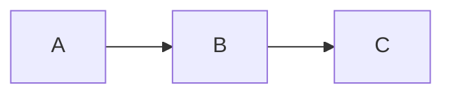

# ResLib Documentation

This directory contains the ResLib documentation website built with [Docusaurus](https://docusaurus.io/).

## Quick Start

```bash
# Install dependencies
npm install

# Start development server
npm run dev

# Build for production
npm run build

# Serve production build locally
npm run serve
```

## Project Structure

```
docs/
├── docs/                    # Documentation markdown files
│   ├── index.md             # Introduction
│   ├── getting-started/     # Getting started guides
│   ├── modules/             # Module documentation
│   └── api/                 # API reference (auto-generated)
├── blog/                    # Blog posts
├── src/
│   ├── css/                 # Custom styles
│   ├── components/          # React components
│   └── pages/               # Custom pages
├── static/                  # Static assets
├── versioned_docs/          # Previous version snapshots
├── versioned_sidebars/      # Previous version sidebars
├── docusaurus.config.ts     # Main configuration
├── sidebars.ts              # Sidebar configuration
└── versions.json            # Version list
```

## Commands

| Command                     | Description                    |
| --------------------------- | ------------------------------ |
| `npm run dev`               | Start development server       |
| `npm run build`             | Build for production           |
| `npm run serve`             | Serve production build         |
| `npm run version:new X.X.X` | Create new version             |
| `npm run api:generate`      | Generate API docs from TypeDoc |
| `npm run clear`             | Clear cache                    |

## Versioning

ResLib uses Docusaurus's built-in versioning:

```bash
# Create a new version snapshot
npm run version:new 2.4.0
```

See the [versioning workflow](../.agent/workflows/docs-versioning.md) for details.

## API Documentation

API docs are auto-generated from TypeScript source using TypeDoc:

```bash
npm run api:generate
```

The generated docs are placed in `docs/api/`.

## Writing Documentation

### Markdown Features

Docusaurus supports:

- Standard Markdown
- MDX (React in Markdown)
- Admonitions (callouts)
- Code blocks with syntax highlighting
- Tabs
- Mermaid diagrams

### Admonitions

```markdown
:::note
This is a note
:::

:::tip
This is a tip
:::

:::warning
This is a warning
:::

:::danger
This is dangerous
:::
```

### Tabs

````jsx
import Tabs from '@theme/Tabs';
import TabItem from '@theme/TabItem';

<Tabs>
<TabItem value="npm" label="npm">

```bash
npm install reslib
````

</TabItem>
</Tabs>
```

### Mermaid Diagrams

````markdown

````

## Deployment

### GitHub Pages

```bash
GIT_USER=<username> npm run deploy
```

### Vercel / Netlify

Standard static site deployment:

```bash
npm run build
# Deploy the `build/` directory
```

## Contributing

1. Edit markdown files in `docs/`
2. Test locally with `npm run dev`
3. Submit a PR

See [Contributing to Documentation](/docs/contributing/documentation) for more.
