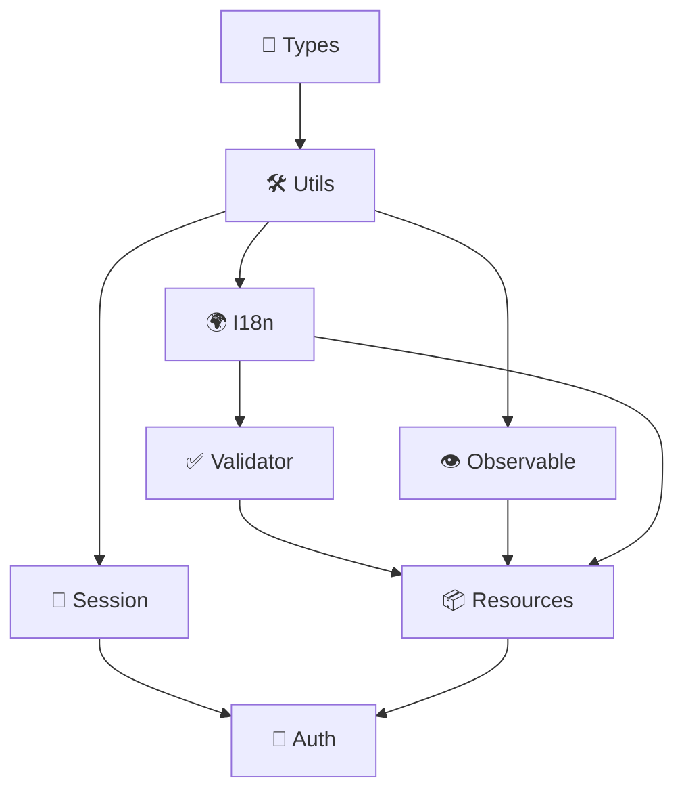

# Modules

ResLib is organized into independent, tree-shakeable modules. Each module can be imported separately to minimize bundle size.

## Module Map



## Available Modules

| Module                                 | Import              | Description                         |
| -------------------------------------- | ------------------- | ----------------------------------- |
| [Resources](/docs/modules/resources)   | `reslib/resources`  | Decorator-based resource management |
| [Validation](/docs/modules/validator)  | `reslib/validator`  | 70+ validation rules with i18n      |
| [I18n](/docs/modules/i18n)             | `reslib/i18n`       | Internationalization system         |
| [Auth](/docs/modules/auth)             | `reslib/auth`       | Authentication utilities            |
| [Session](/docs/modules/session)       | `reslib/session`    | Session management                  |
| [Observable](/docs/modules/observable) | `reslib/observable` | Event system                        |
| [Utils](/docs/modules/utils)           | `reslib/utils`      | Utility functions                   |
| Types                                  | `reslib/types`      | TypeScript type definitions         |

## Import Patterns

### Recommended: Specific Imports

```typescript
// ✅ Import only what you need
import { Resource, ResourceMeta, FieldMeta } from 'reslib/resources';
import { Validator, IsRequired, IsEmail } from 'reslib/validator';
import { I18n } from 'reslib/i18n';
```

This ensures optimal tree-shaking and minimal bundle size.

## Quick Reference

### Resources

```typescript
import { ResourceMeta, FieldMeta, Resource } from 'reslib/resources';

@ResourceMeta({ name: 'User' })
class User extends Resource<'User'> {
  @FieldMeta({ type: 'string' })
  name: string;
}
```

### Validation

```typescript
import { Validator, IsRequired, IsEmail } from 'reslib/validator';

class UserDto {
  @IsRequired()
  @IsEmail()
  email: string;
}

// Or schema-based
const schema = Validator.object({
  email: ['Required', 'Email'],
});
```

### I18n

```typescript
import { I18n } from 'reslib/i18n';

const i18n = I18n.getInstance();
i18n.t('greeting', { name: 'World' });
```

### Observable

```typescript
import { observableFactory } from 'reslib/observable';

const events = observableFactory();
events.on('userCreated', (user) => console.log(user));
events.trigger('userCreated', { id: 1, name: 'John' });
```

### Utils

```typescript
import { defaultStr, isEmpty, isEmail } from 'reslib/utils';

defaultStr(value, 'fallback');
isEmpty(''); // true
isEmail('test@example.com'); // true
```
